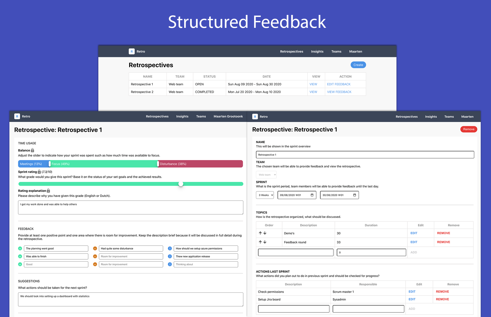
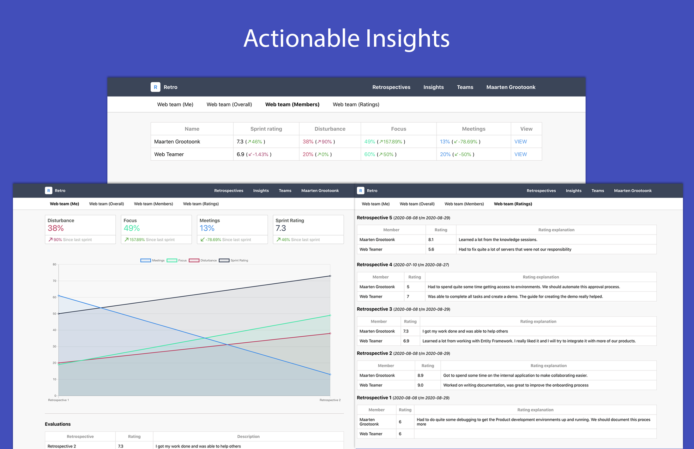

# Retrospective API
WebAPI for the [retrospective client](https://github.com/MaartenGDev/retrospective-client).

## Preview
##### Feedback

##### Insights

## Setup
1. `dotnet restore`
2. Copy `appsettings.json` to `appsettings.Development.json`
3. Configure your database credentials
4. Setup the database: `dotnet ef database update`

## Stack
- .NET Core 3.1
- Entity Framework
- Microsoft AD authentication